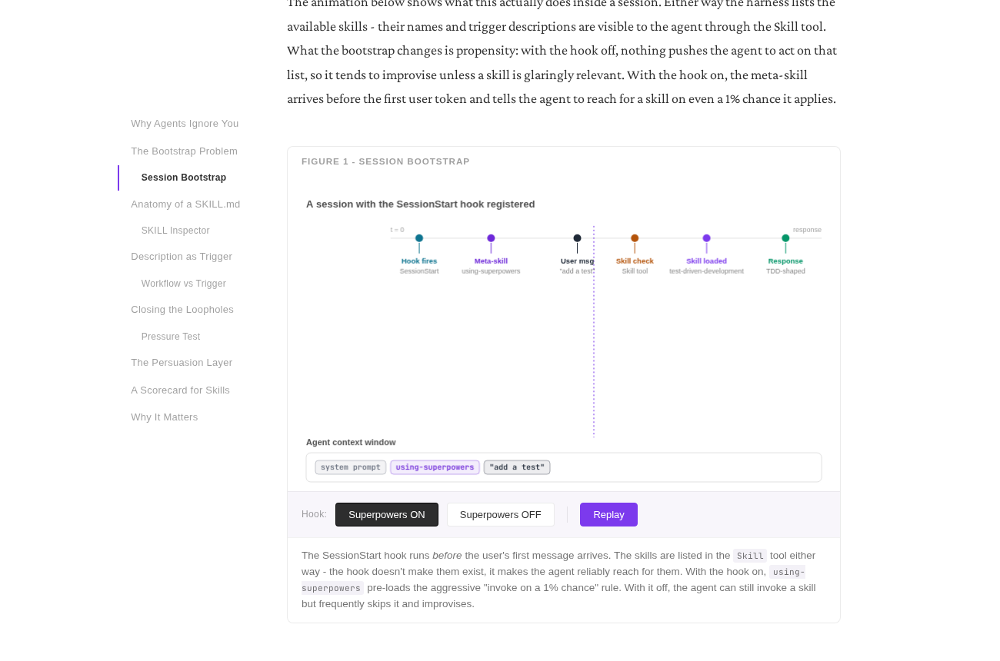
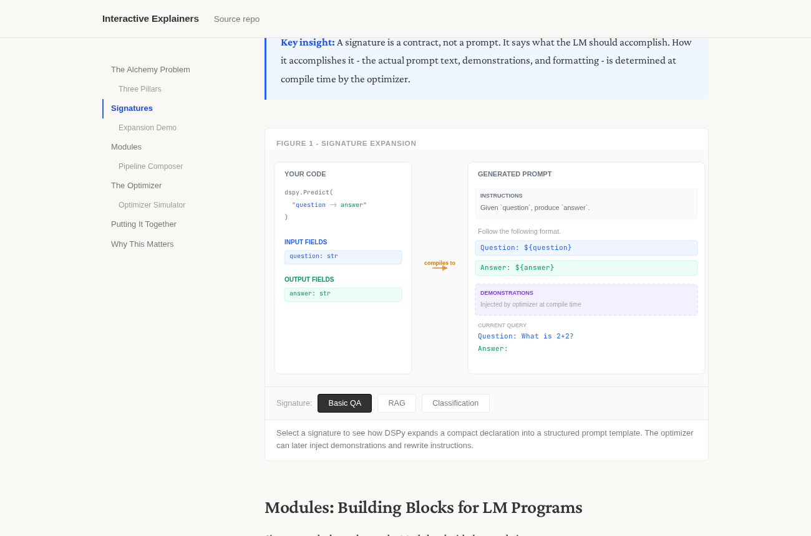

# Explain this 🔌💡

An Agent Skills package for creating distill-style interactive explainers - single self-contained `index.html` pages with a sticky two-column layout, hand-built Canvas figures, and conversational prose, like the articles at [distill.pub](https://distill.pub). Zero dependencies, no build step.

## The skills

- **creating-explainers** - the hub. Turns a paper, blog post, transcript, or research report into an explainer, or researches a topic from scratch, or both. Owns the template, figures, voice, and the staged workflow.
- **explaining-codebases** - explains a repository or set of source files: an onboarding overview of how a project is structured, or a deep-dive on how one mechanism works. Same output format, with code navigation and code-specific figures.
- **fact-checking-explainers** - a gate the other two pass before delivery. Every checkable claim must trace to a source (or, for code, the real implementation), or be corrected or cut. No incorrect claim ships.

Each skill triggers automatically when you describe the matching goal. You can also invoke fact-checking on its own.

## Examples

Two interactive explainers built with this skill set. Open them and play with the figures - they step, drag, and toggle right in the browser.

**[Superpowers: The Anatomy of an Agent Skill](https://www.akashtandon.in/interactive-explainers/superpowers/)**

[](https://www.akashtandon.in/interactive-explainers/superpowers/)

**[DSPy: Programming - Not Prompting - Language Models](https://www.akashtandon.in/interactive-explainers/dspy/)**

[](https://www.akashtandon.in/interactive-explainers/dspy/)

## Requirements

No API keys, no build tools. The skills use your agent's own file and web tools: research intake needs web search/fetch to be available, and the output is a single self-contained `index.html` you open in a browser.

## Installation

### Claude Code

explain-this is a Claude Code plugin, so it installs through the plugin marketplace. Adding the marketplace and installing the plugin pulls in all three skills at once:

```
/plugin marketplace add analyticalmonk/explain-this
/plugin install explain-this@explain-this
```

The first command points Claude Code at this repo on GitHub; the second installs the `explain-this` plugin from it. The skills land in `~/.claude/skills/` and trigger automatically.

Prefer a local clone, or the repo is not published yet? Add the marketplace from a local path instead:

```
git clone https://github.com/analyticalmonk/explain-this.git
/plugin marketplace add ./explain-this
/plugin install explain-this@explain-this
```

**Updating:** Claude Code does not auto-update plugins yet. To pull a newer version, refresh the marketplace and reinstall:

```
/plugin marketplace update explain-this
/plugin install explain-this@explain-this
```

### OpenAI Codex

This repo is also a Codex plugin package. The Codex manifest lives at `.codex-plugin/plugin.json` and points at the same three skill folders under `skills/`.

Add the marketplace and install the plugin from Codex CLI:

```bash
codex plugin marketplace add analyticalmonk/explain-this
codex plugin add explain-this@explain-this
```

The first command points Codex at this repo on GitHub; the second installs the `explain-this` plugin from that marketplace. Start a new thread after installing so Codex picks up the bundled skills. You can also browse installed and available plugins from the Codex TUI with `/plugins`.

Prefer a local clone, or the repo is not published yet? Clone or symlink this repo to `~/plugins/explain-this`, then point a Codex marketplace entry at that plugin source. A minimal personal marketplace entry looks like this:

```json
{
  "name": "personal",
  "interface": {
    "displayName": "Personal"
  },
  "plugins": [
    {
      "name": "explain-this",
      "source": {
        "source": "local",
        "path": "./plugins/explain-this"
      },
      "policy": {
        "installation": "AVAILABLE",
        "authentication": "ON_INSTALL"
      },
      "category": "Education"
    }
  ]
}
```

Put that in `~/.agents/plugins/marketplace.json`, restart Codex, then open `/plugins` in Codex CLI or the Plugins view in the Codex app and install **Explain This**. Codex resolves `./plugins/explain-this` relative to your home directory for the personal marketplace.

If you only want the skills without plugin installation, copy or symlink the folders into a Codex skill location such as `$HOME/.agents/skills/`:

```bash
mkdir -p "$HOME/.agents/skills"
cp -R skills/creating-explainers \
      skills/explaining-codebases \
      skills/fact-checking-explainers \
      "$HOME/.agents/skills/"
```

Codex can then invoke them explicitly with `$creating-explainers`, `$explaining-codebases`, or `$fact-checking-explainers`.

### Other agents that read Agent Skills

The repo also follows the open [Agent Skills](https://code.claude.com/docs/en/skills) layout (`skills/<name>/SKILL.md`). As of 2026 that format is read by several other coding agents, including **Google Gemini CLI** and **GitHub Copilot** (in VS Code), as well as **Cursor** (which needs the skill placed manually) and tools like Cline, Windsurf, and Zed.

These agents do not use the Claude Code or Codex plugin marketplaces. Install is manual: clone the repo and point your agent at the three skill folders, or copy them into whatever directory your agent loads skills from.

```bash
git clone https://github.com/analyticalmonk/explain-this.git
#   skills/creating-explainers/
#   skills/explaining-codebases/
#   skills/fact-checking-explainers/
```

Caveat worth knowing: these skills were authored and tested in Claude Code and Codex. Some references still mention Claude Code tool names (Read, Edit, Bash, WebSearch / WebFetch), so they may need light adaptation in other Agent-Skills-compatible tools.

### Not supported

There is no install for environments without a skills mechanism: the web chat apps (claude.ai, ChatGPT, and Gemini in the browser) and the bare model APIs. They cannot load `SKILL.md` skills at all. The only way to use the workflow there is to paste a skill's contents into the conversation by hand, which is not really supported and loses the lazy-loaded references that keep the skills light.

## Usage

Your agent picks the right skill up automatically when you say things like:

- "Make an interactive explainer about RLHF" (research intake)
- "Turn this paper into a distill-style article" (files intake)
- "Explain how this repo's scheduler works, as an interactive guide" (codebase)

Whichever path you take, the explainer is fact-checked before it is delivered: every claim is traced to its source or the real code, and anything unsupported is corrected or cut.

## What's in this repo

```
.codex-plugin/
  plugin.json                       # Codex plugin manifest
.claude-plugin/
  plugin.json                       # Claude Code plugin manifest
  marketplace.json                  # marketplace entry for /plugin marketplace add
skills/
  creating-explainers/
    SKILL.md
    agents/openai.yaml              # Codex UI metadata
    assets/article-template.html    # complete HTML skeleton, copy and fill in {{PLACEHOLDERS}}
    references/                      # intake (files / research), figures, voice, template, palettes
  explaining-codebases/
    SKILL.md
    agents/openai.yaml
    references/                      # code intake, code-specific figure archetypes
  fact-checking-explainers/
    SKILL.md
    agents/openai.yaml
    references/verification-report-format.md
evals/
  evals.json                        # 5 reference prompts the skills are developed against
```

The references load lazily - your agent reads them only when relevant, so the skills don't burn context up front.

## License

MIT - see [LICENSE](LICENSE).
